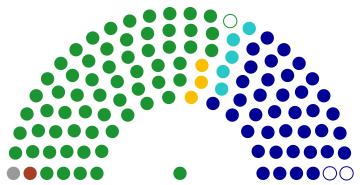

## Electoral Reform and Disunited Polarization:   Evidence from Legislative Roll Calls     

- This repository stores [code]() and [replication data](https://raw.githack.com/davidycliao/erdp/master/data/out.estimates_binIRT.csv) of preliminary results for this paper. 
- The working draft ( [pdf](https://raw.githack.com/davidycliao/erdp/master/paper/David-YCLIAO-POPE-Feb-24.pdf) ) will be presented at the APSA Virtual Annual Meeting, September 10, 2020. 
- Slides can be found here ( [html](https://raw.githack.com/davidycliao/erdp/master/slides/slides.html) | [pdf](https://raw.githack.com/davidycliao/erdp/master/slides/slides.pdf) ).
- Feel free to drop me a message by [email](https://github.com/davidycliao) or [create an issue](https://github.com/davidycliao/erdp/issues) on here. 

 

## Acknowledge 

- The roll call data analyzed in this project were collected by [the Center for Legislative Studies](http://cls.idc.scu.edu.tw/), Department of Political Science Soochow University, and directed by [Profession Shiow-Duan Hawang](https://ahrccfc.weebly.com/shiow-duan-hawang.html). We appreciate the assistance in providing the data. 

