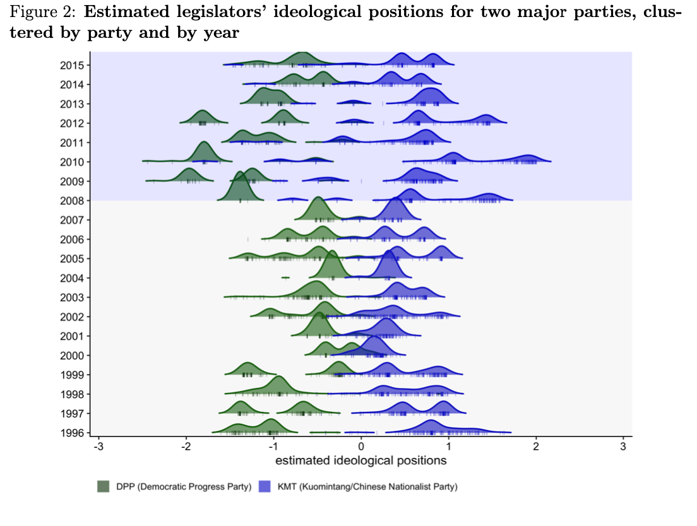
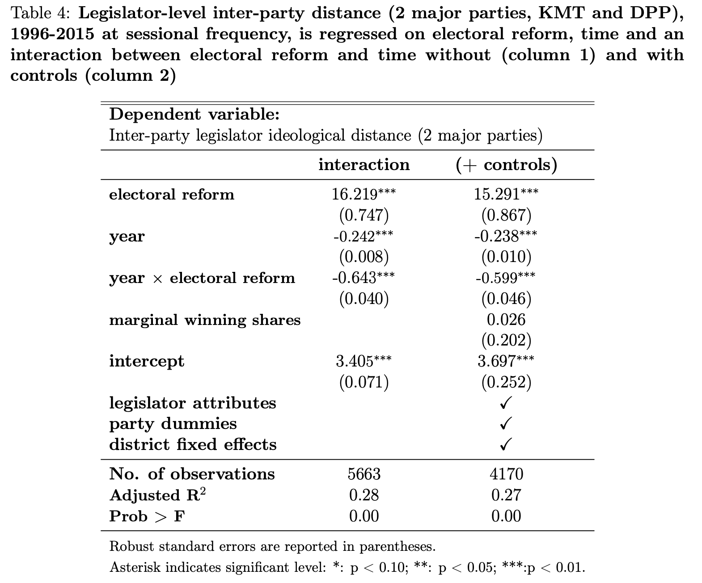
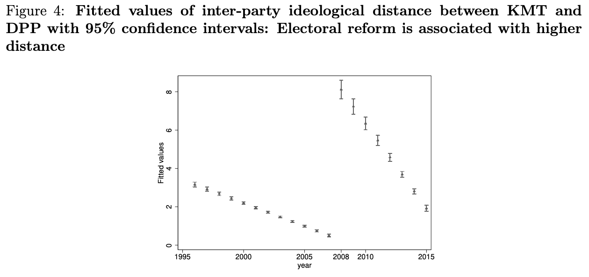
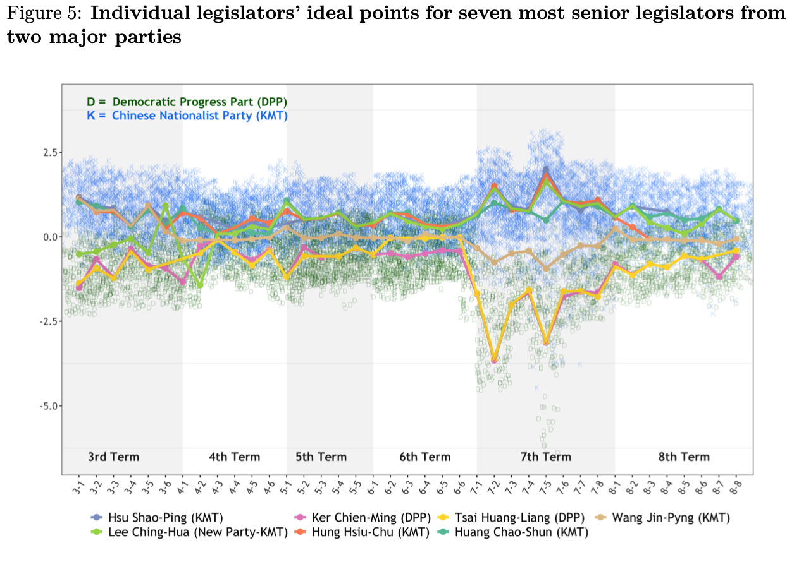
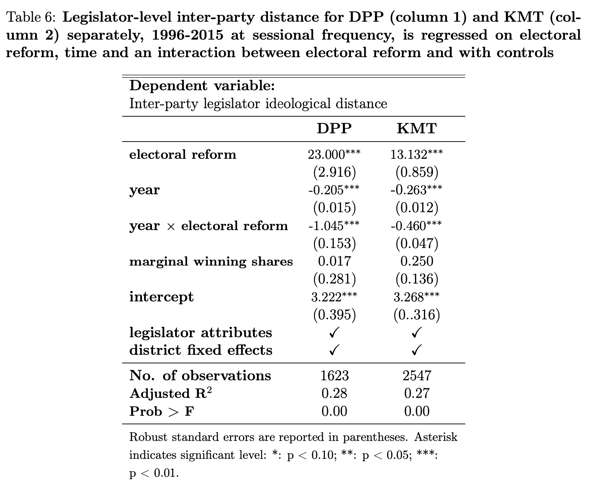
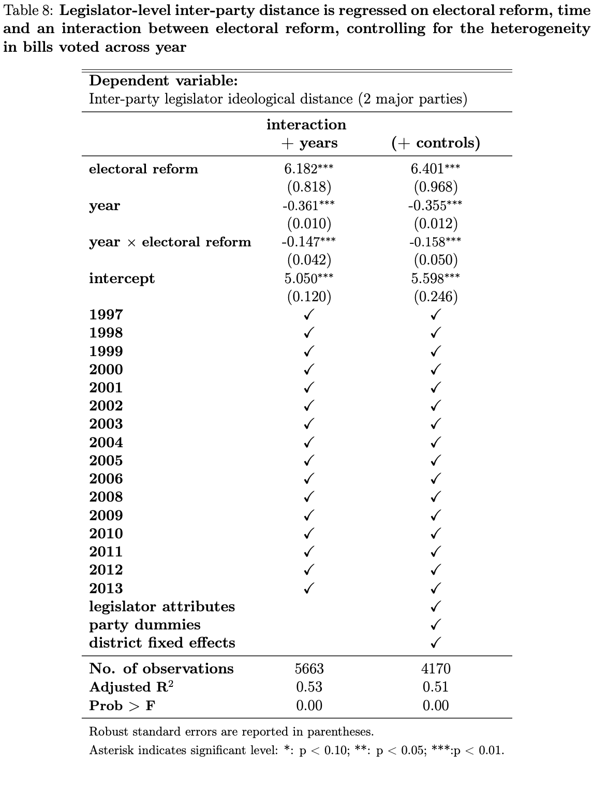
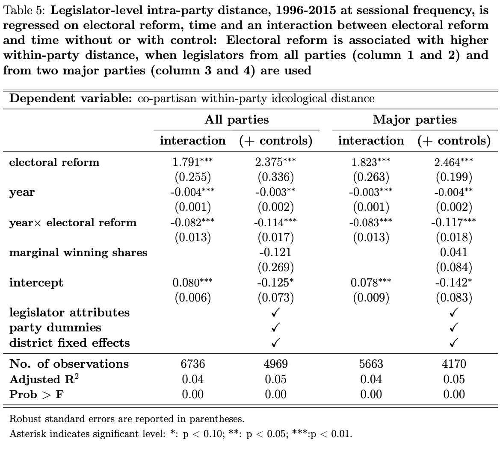
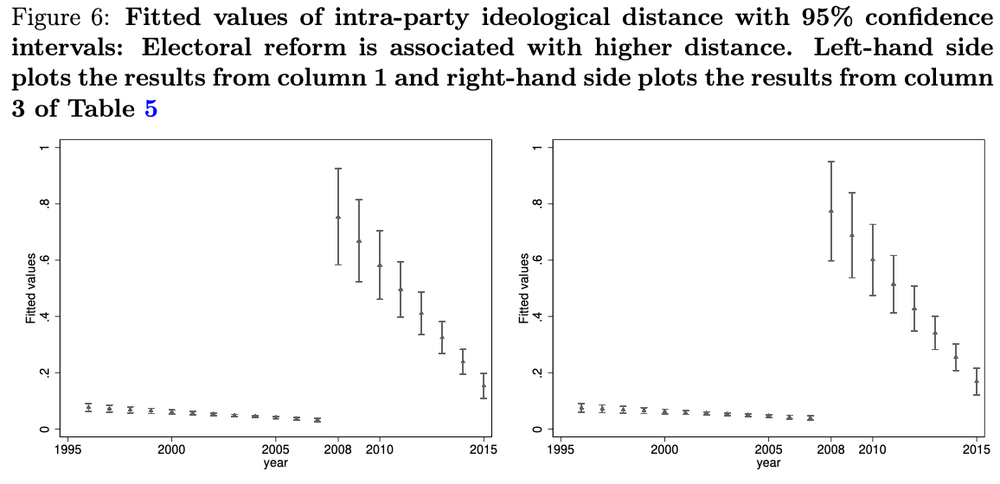
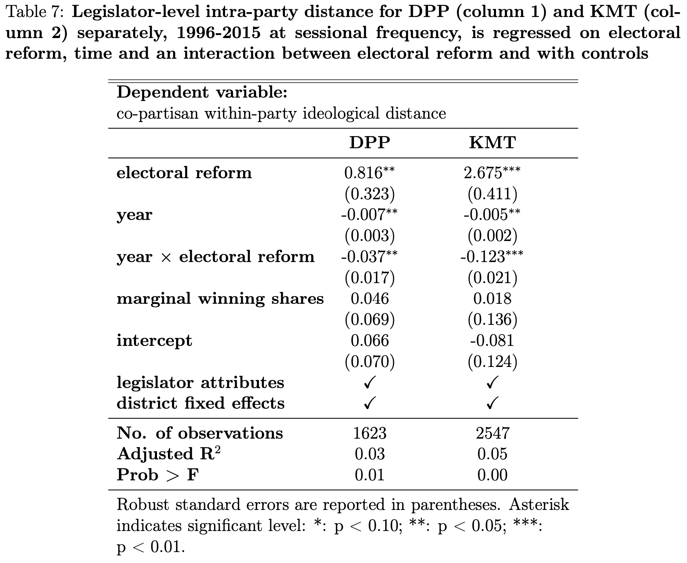

exclude: true


```{r, include = F}
# install.packages("pacman")
library(pacman)
p_load(
  kableExtra, snakecase, janitor, huxtable, pagedown, # Formating 
  ggplot2, ggthemes, ggeffects, ggridges, igraph, network, ggpubr, ggformula, gridExtra, RColorBrewer, # Visualization
  tidyverse, lubridate, stringr, dplyr, purrr, tibble, tidyr, lubridate, knitr, # General tidyverse toolkit 
  readxl,reshape2, 
  parallel, future, furrr, future.apply, doParallel, # Paralleling
  emIRT, MCMCpack, wnominate, pscl, rgenoud, basicspace,  # for scaling   
  devtools, reticulate, usethis # programming
)


p_load_gh("kosukeimai/emIRT", # for scaling from Github
          "tzuliu/ooc",
          "cran/oc",
          "uniofessex/asmcjr",
          "wmay/dwnominate", dependencies = TRUE)


# Define colors
red_pink   = "#e64173"
turquoise  = "#20B2AA"
orange     = "#FFA500"
red        = "#fb6107"
blue       = "#3b3b9a"
green      = "#8bb174"
grey_light = "grey70"
grey_mid   = "grey50"
grey_dark  = "grey20"
purple     = "#6A5ACD"
brown      = "#9b684d"
black      = "#000000"
# Tetradic Color
magenta_red = "#9b4d80"
magenta_green = "#4d9b68"
red_green = "#9b4d59"
blue_green = "#4d599b"
magenta_yellow = "#9b8f4d"


# Knitr options
opts_chunk$set(
  comment = "#>",
  fig.align = "center",
  fig.height = 7,
  fig.width = 10.5,
  warning = F,
  message = F
)
opts_chunk$set(dev = "svg")
options(device = function(file, width, height) {
  svg(tempfile(), width = width, height = height)
})
options(knitr.table.format = "html")

# pagedown::chrome_print("file:///Users/yenchiehliao/Box/myBox/erdp/slides.html#1", verbose = FALSE)


```

---
layout: true
# Research Questions
---
name:questions


&nbsp;

- This article investigates the strategic (inter- and intra-) party positioning in response to an .hi-slate[electoral system transition] from single non-transferable voting (SNTV) to single-member districts (SMDs)  by studying the 2008 electoral reform in Taiwan and provides empirical evidence to the following questions.

--

- Does the switch of electoral system from SNTV to SMDs mitigate political polarization among parties? 

--

- Does it influence the intra-party unitedness (cohesiveness), and thus, change legislators' ideological positioning? 


---
layout: true
# Puzzles
---
name:puzzles

&nbsp;

- How electoral rules shape .hi-turquoise[legislative preference] is key to understand the theoretical development of party politics and party competition in the real world. 

--

- Previous studies have envisioned a number of potential reasons that explain why legislators position themselves differently under .hi-purple[different electoral systems] (e.g. Catalinac 2017) or electoral rules in mixed member electoral systems (e.g. Batto 2012; Jun and Hix 2010; Rich 2014).

--

- Recent decades saw .hi-orange[reforms of electoral systems] from SNTV to SMDs in East- Asian democracies (i.e. Japan, South Korea and Taiwan). 

---

&nbsp;

- For example, Catalinac (2016) finds that Liberal Demo- cratic Party candidates in SMDs .hi-slate[adopted new electoral strategies] by providing programmatic policy benefits such as national security among other candidates affiliated with LDP party, reducing promise of pork barrel goods and intra-party competition. 

--

- This finding is complementary with other research (Catalinac 2017), which estimates the ideological positions via scaling Japanese election manifestos and demonstrated that .hi-turquoise[candidates under SNTV positioned themselves against their party].

---
layout: true
# Hypothesis
---
name:hypothesis

&nbsp;
&nbsp;

### .hi-grey[Hypothesis 1]: 
Switching from SNTV to SMDs mitigated the level of political polarization between parties, particularly between __KMT__ (Chinese Nationalist Party) and __DPP__ (Democratic Progress Party).

--

### .hi-grey[Hypothesis 2]: 
Switching from __SNTV__ to __SMDs__ united co-partisan legislators in terms of ideological positions.

---
layout: true
# Research Design
---
name:research-design

- First, we estimate individual legislator's ideological positions from sessional roll call votes continuously covering .hi-slate[ex-ante and ex-post periods of the reform].

--

- Expectation Maximization (EM) algorithm is applied to a dynamic ideal point model to estimate each legislator's position from 1992 to 2015 at a sessional frequency, where individual recursively updates her .hi-turquoise[prior of ideal point every session].

--

- Then, .hi-purple[inter- and intra-party distance of ideological positions] are constructed from the estimated positions.

--

- Finally, econometric regressions are introduce to empirically examine the above two hypotheses and find noticeable shifts in ideological positions after the reform. 

---
layout: true
# Taiwan Legislative Roll Calls
---
name:data
&nbsp;


```{r echo = F, out.width = "80%"}
knitr::include_graphics("./images/table_1.png")
```


---
layout: true
# Ideal Point Estimation
---
name:data

##### Imai, Kosuke, James Lo, and Jonathan Olmsted (2016). “Fast Estimation of Ideal Points with Massive Data”. In: American Political Science Review 110.4, pp. 631–656.


```{r echo = F, out.width = "70%"}

```

---
layout: true
# Inter-party Polarization 
---
name:data

&nbsp;


- To evaluate the Hypothesis 1, we calculate .hi-slate[the legislator-level inter-party dispersion] between two major parties, KMT and DPP (between party polarization). It is calculated as: 

$$\mathbf{interdistance_{it}=|position_{it}-\bar{whip_{it}|},}$$
--

- We specify the following regression model, allowing the passage of time (year) to have different marginal effects on inter-party ideological distance, prior to and post the electoral reform.

$$\begin{aligned}
\mathbf{ interdistance_{it}=\alpha_{0}+\alpha_{1}electoralreform_{t}+\alpha_{2}year_{t}+} \\
\mathbf{\alpha_{3}(year_{t}\times electoralreform_{t})+C_{it}+\epsilon_{it}^{1},} \end{aligned}$$

---
layout: true
# Testing Hypothesis 1
---
name:data

```{r echo = F, out.width = "75%"}

```


---

&nbsp;
```{r echo = F, out.width = "100%"}

```

---

```{r echo = F, out.width = "90%"}

```

---

```{r echo = F, out.width = "75%"}

```

---

To address the issue of heterogeneity in bills voted across time
```{r echo = F, out.width = "48%"}

```

---
layout: true
# Intra-party Polarization
---
name:data

&nbsp;

- To evaluate the Hypothesis 2, we calculate .hi-slate[the dispersion in co-partisan legislator's estimated ideological positions (within-party disunity)]. It is calculated as: 
$$\mathbf{intradistance_{it}=|position_{it}-whip_{it}|,}.$$

--

- The regression model is constructed as follow.

$$\begin{aligned} \mathbf{intradistance_{it}=\beta_{0}+\beta_{1}electoralreform_{t}+\beta_{2}year_{t}+}	\\
\mathbf{\beta_{3}(year_{t}\times electoralreform_{t})+\tilde{C}_{it}+\epsilon_{it}^{2},}\end{aligned}$$


---
layout: true
# Testing Hypothesis 2
---
name:data

```{r echo = F, out.width = "75%"}

```


---

&nbsp;
```{r echo = F, out.width = "95%"}

```

---

```{r echo = F, out.width = "75%"}

```

---
layout: true
# Takeaway
---
name:conclusion

&nbsp;

- Our findings suggest a phase of “.hi-slate[disunited polarization]” among .hi-turquoise[inter-party] and .hi-purple[co-partisan legislators] during the transition.

--

- Empirical test results show that this switching not only .hi-turquoise[exacerbated] inter-party ideological polarization by distancing legislators’ positions from their opponents, but also .hi-purple[disunited] co-partisan legislators as their positions became more widely distributed along the ideological spectrum.

---

&nbsp;

- Although the first finding is contrary to some .hi-pink[manifesto studies] like Catalinac (2017) that SMDs reduce the inter- and intra-party polarization in countries like Japan, it is generally complementary with the study of Jang and Lin (2019)’s seminar work on Taiwan legislative roll calls over the entire period of the SNTV system. 

--

- Our paper contributes to the large body of literature of electoral reforms by adding some empirical evidence in .hi-slate[Asian democracies] and also it highlights the possibility of the ineffectiveness of using electoral reforms as means of alleviating political chaos.

---
layout: true
# Takeaway
---
name:conclusion


---
layout: false
class: inverse, center, middle

# Thank You
